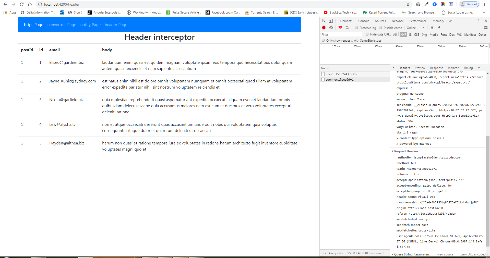
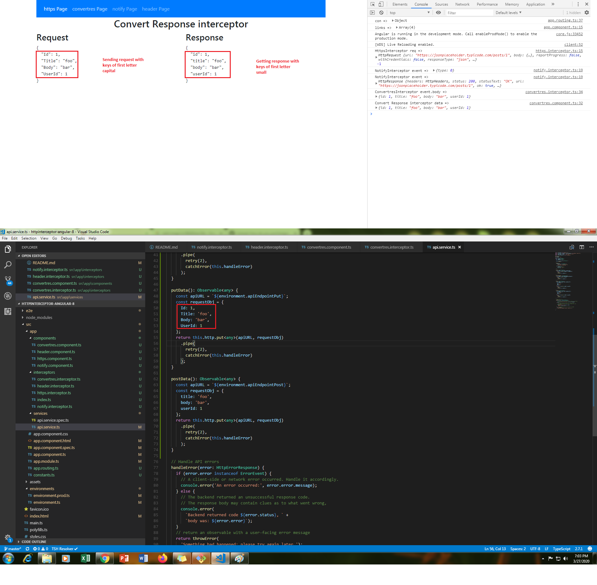

# Run Application
```
ng serve
localhost:4200/
```

# interceptor

https://medium.com/angular-in-depth/top-10-ways-to-use-interceptors-in-angular-db450f8a62d6
https://stackblitz.com/github/melcor76/interceptors?file=src%2Fapp%2Finterceptors%2Fnotify.interptor.ts

HttpInterceptor was introduced with Angular 4.3. It provides a way to intercept HTTP requests and responses to transform or handle them before passing them along.

# Https Interceptor (To change the request)
### Manipulating the URL



Sounds a bit risky when I say it out loud but let’s see how easily we can do it in an interceptor.
We could, for example, want to change HTTP to HTTPS.
It’s as easy as cloning the request and replacing http:// with https:// at the same time. Then we send the cloned, HTTPS request to the next handler.

```
// clone request and replace 'http://' with 'https://' at the same time
const httpsReq = req.clone({
  url: req.url.replace("http://", "https://")
});

return next.handle(httpsReq);
```

In the example, we set the URL with HTTP, but when we check the request, we can see that it changed to HTTPS.

environments/environment.ts
```
export const environment = {
  production: false,
  apiEndpoint: 'http://jsonplaceholder.typicode.com/users'
};
```


# Convertres Interceptor (To change the response)
### Change the first letter of response JSON keys



```
              if (event instanceof HttpResponse) {
                    function toConvert(ele) {
                        const fr = ele.charAt(0).toLowerCase();
                        const full = fr + ele.slice(1);
                        return full;
                    }
                    const resObj = event.body;
                    const sample = Object.keys(resObj).map(key => ({
                        [toConvert(key)]: resObj[key]}
                    ));
                    const newObj = Object.assign({}, ...sample);
                    console.log('ConvertresInterceptor event.body => ', newObj);
                    const newRes = event.clone({body: newObj});
                    return newRes;
                }
```


# Header Interceptor (To change the request)
### Add header of request


```
        if (!req.headers.has('Content-Type')) {
            req = req.clone({
              headers: req.headers.set('Content-Type', 'application/json')
            });
          }
        const head = req.clone({setHeaders: {'Header-Name' : 'Piyali Das'}});
        return next.handle(head);
```

# Notify Interceptor (Notify about response change)


```                
                if (event instanceof HttpResponse && event.status === 201) {
                    this.toastr.success('Successfully created');
                } else {
                    this.toastr.error('Sorry! Not Successfully created');
                }
```                

### Rxjs Pipe

Pipes let you combine multiple functions into a single function. The pipe() function takes as its arguments the functions you want to combine, and returns a new function that, when executed, runs the composed functions in sequence.